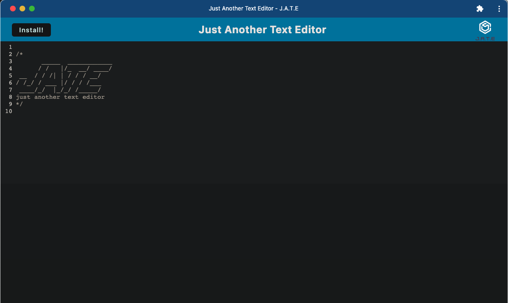
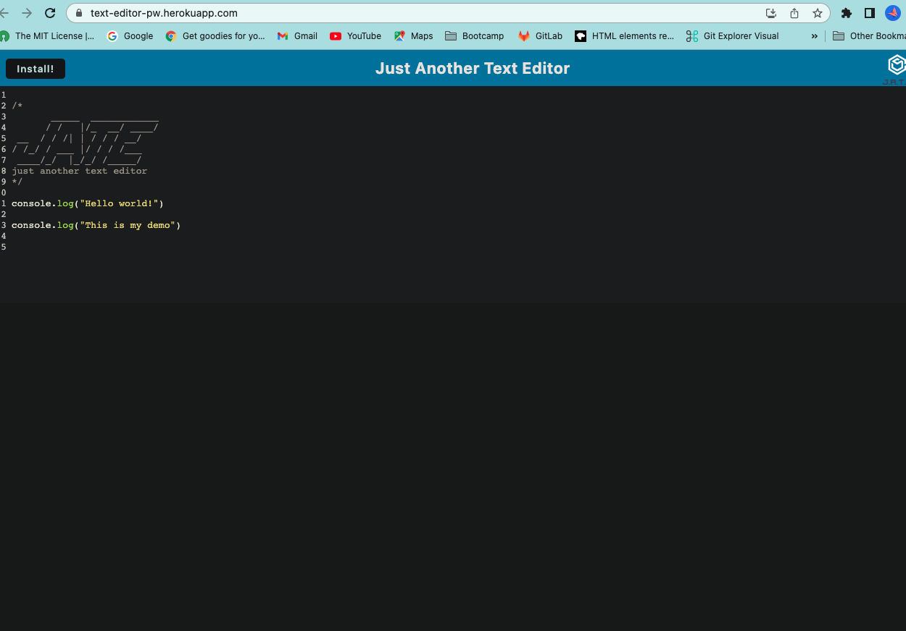

# PWA-Text-Editor

## Description

This application is a single-page PWA text editor that runs in the user's browser. It was created by adding methods for getting and storing data to an IndexedDB database. It can be used to create notes or code snippets with or without an internet connection, to be retrieved from local storage for later use.

---

---

---

### How to Use:

Click the link below:

[Deployed App on Heroku](https://text-editor-pw.herokuapp.com/)

Then, select the `Install!` button to install the text editor as a `Chrome` browser application.

From the command-line, type `npm run start` from the root of the application, and open the editor in `localhost:3000` to use locally.

---

#### Technology Used:

---

#### Author

[Heather Cooper](https://github.com/cheribc)

---

#### License

[MIT](LICENSE)